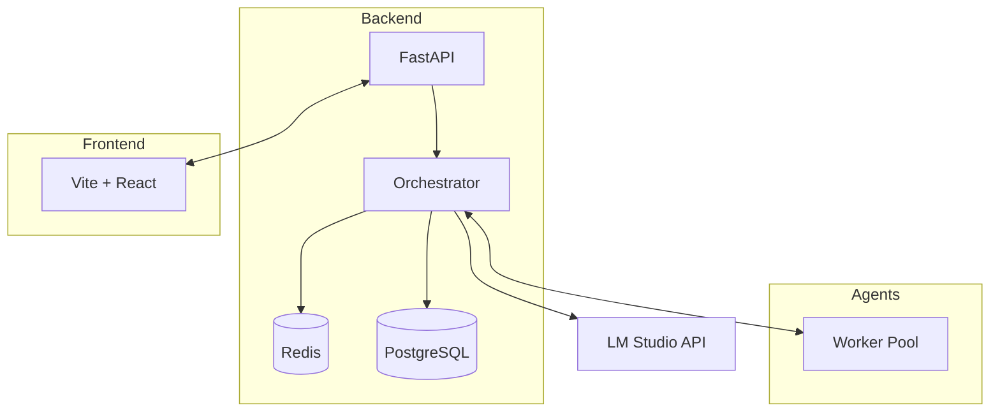

# Monorepo Architecture Blueprint



### Directory Layout
```
/backend     # FastAPI app and business logic
/frontend    # React UI powered by Vite
/scripts     # Utility scripts
/docs        # Documentation
/tests       # Pytest and Jest suites
```
\nThe orchestrator communicates with worker agents through a registration handshake and a priority-based task queue in Redis.
