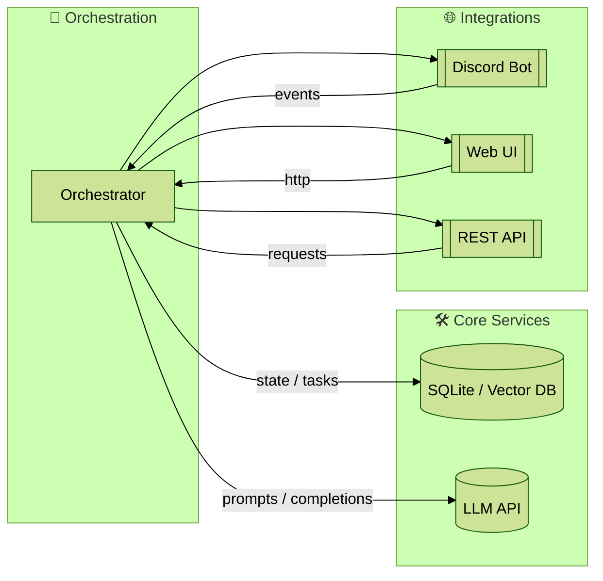
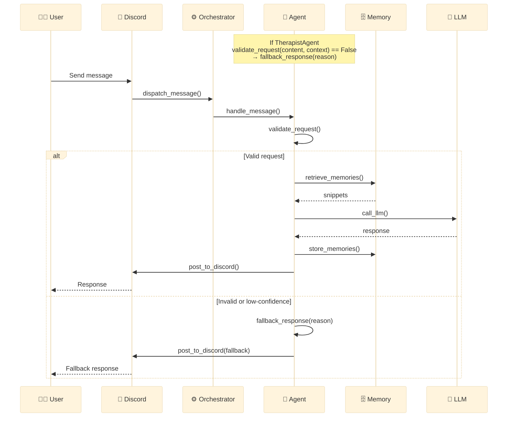
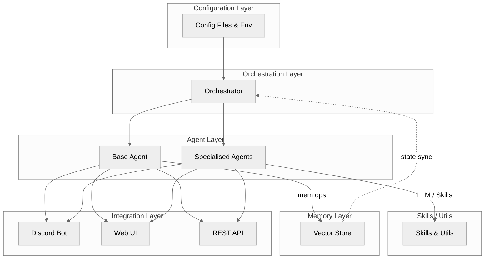
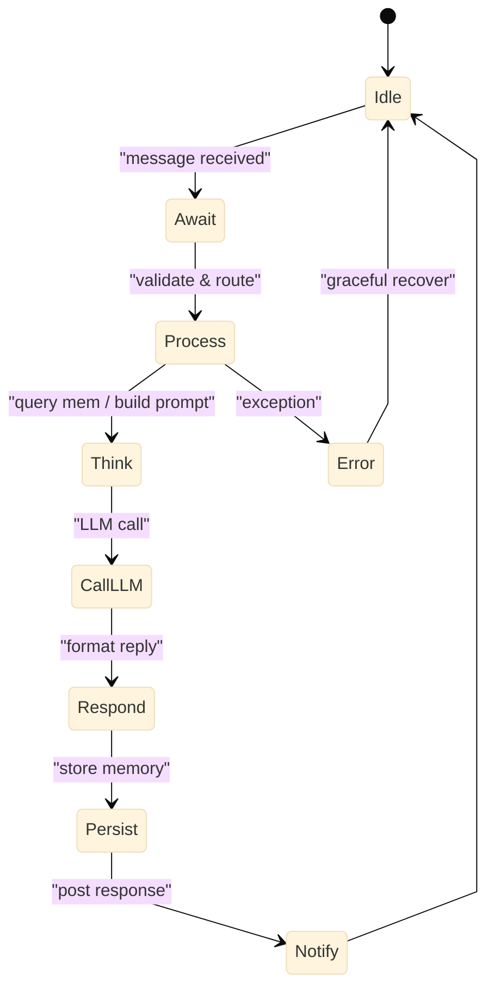
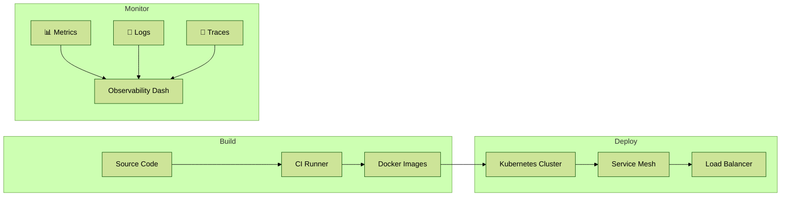
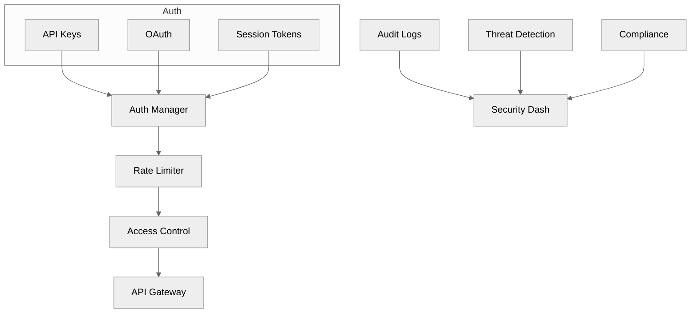

# Legion Comprehensive Documentation

This document consolidates the core documentation for the Legion project, including architecture details and system diagrams. It serves as a single reference point for understanding the system's structure and visual representations.

---

## Table of Contents
1. [System Architecture](#system-architecture)
2. [System Diagrams](#system-diagrams)
   - [High‑Level Architecture](#high-level-architecture)
   - [Primary Message Flow](#primary-message-flow)
   - [Layer Interaction Map](#layer-interaction-map)
   - [Agent Lifecycle (State Machine)](#agent-lifecycle-state-machine)
   - [Deployment Pipeline](#deployment-pipeline)
   - [Security Layers](#security-layers)
   - [Composite Integration](#composite-integration)
   - [Function-to-Diagram Index](#function-to-diagram-index)

---

## System Architecture

### System Overview

Legion is a modular agent orchestration system organized into distinct layers, each with specific responsibilities and interfaces.

### Core Layers

#### 1. Configuration Layer
- **Location**: `legion/configs/`
- **Purpose**: Centralized configuration management
- **Components**:
  * Agent definitions (YAML)
  * Environment variables
  * Service configurations
  * Channel mappings

#### 2. Core Layer
- **Location**: `legion/core/`
- **Purpose**: Fundamental system services
- **Components**:
  * Dependency injection container
  * Service interfaces
  * Utility functions
  * Error handling
  * Logging framework

#### 3. Agent Layer
- **Location**: `legion/agents/`
- **Purpose**: Agent implementations and management
- **Components**:
  * Base agent framework
  * Specialized agents
  * Agent factory
  * Agent lifecycle management

#### 4. Memory Layer
- **Location**: `memory/`
- **Purpose**: Persistent state and context
- **Components**:
  * Vector storage
  * Memory indexing
  * Context management
  * State persistence

#### 5. Integration Layer
- **Location**: `integration/`
- **Purpose**: External service integration
- **Components**:
  * Discord bot
  * Web interface
  * API endpoints
  * WebSocket support

#### 6. Skills Layer
- **Location**: `skills/`
- **Purpose**: Reusable agent capabilities
- **Components**:
  * Search functionality
  * Summarization
  * Network operations
  * Indexing utilities

### Service Interfaces

#### 1. Agent Service
```python
class AgentService(Protocol):
    async def initialize(self) -> None
    async def handle_message(self, content: str, context: dict) -> str
    async def self_assess(self) -> None
    async def cleanup(self) -> None
```

#### 2. Memory Service
```python
class MemoryService(Protocol):
    async def store(self, key: str, value: Any) -> None
    async def retrieve(self, key: str) -> Any
    async def search(self, query: str, limit: int) -> List[Any]
    async def clear(self) -> None
```

#### 3. LLM Service
```python
class LLMService(Protocol):
    async def generate(self, prompt: str, context: dict) -> str
    async def embed(self, text: str) -> List[float]
    async def validate(self) -> bool
```

### Dependency Injection

The system uses a dependency injection container to manage service lifecycles and dependencies:

```python
class Container:
    def __init__(self):
        self.agent_service: AgentService
        self.memory_service: MemoryService
        self.llm_service: LLMService
        self.config_service: ConfigService
```

### Error Handling

- Structured error hierarchy
- Error boundaries at service boundaries
- Telemetry and logging integration
- Graceful degradation

### Testing Strategy

1. **Unit Tests**
   - Service interfaces
   - Agent implementations
   - Utility functions

2. **Integration Tests**
   - Service interactions
   - Agent collaboration
   - Memory persistence

3. **Performance Tests**
   - Response times
   - Memory usage
   - Concurrent operations

4. **Security Tests**
   - Input validation
   - Authentication
   - Authorization

### Deployment

The system is deployed as a collection of services:

1. **Core Services**
   - Orchestrator
   - Memory service
   - LLM service

2. **Integration Services**
   - Discord bot
   - Web interface
   - API server

3. **Monitoring**
   - Metrics collection
   - Health checks
   - Log aggregation

### Future Improvements

1. **Scalability**
   - Horizontal scaling of agents
   - Distributed memory
   - Load balancing

2. **Reliability**
   - Circuit breakers
   - Retry mechanisms
   - State recovery

3. **Observability**
   - Distributed tracing
   - Performance metrics
   - Error tracking

4. **Security**
   - Role-based access
   - Audit logging
   - Encryption at rest

### Modules
- Orchestrator
- Agents
- Skills
- Memory
- Integration
- Interface

### Unified Agent Message Handling

All agents in Legion now use a single, unified message handling pipeline inherited from BaseAgent. This pipeline:
- Loads the agent's default prompt from config (with fallback)
- Retrieves top-K relevant memory snippets using the memory module's index helper
- Fetches the last N messages from the Discord thread
- Builds the LLM payload in the order: system prompt, memory summary, thread history, user message
- Sends the payload to the LLM and posts the reply
- Extracts and stores new memory items from the reply

This eliminates all per-agent prompt orchestration and ensures robust, consistent behavior across all personas.

---

## System Diagrams

> **Tip**: All diagrams below are Mermaid‑formatted. Copy only the code inside the ```mermaid fences into the [Mermaid Live Editor](https://live-editor.mermaidjs.io/) for instant previews.

### High‑Level Architecture



### Primary Message Flow



### Layer Interaction Map



### Agent Lifecycle (State Machine)



### Deployment Pipeline



### Security Layers



### Composite Integration

```mermaid
%%{ init: { "theme": "base", "flowchart": { "curve": "basis" } } }%%
flowchart LR
    subgraph Interfaces
        UI[User / External API]
    end
    subgraph Orchestration
        ORCH[Orchestrator]
        CFGM[Config Mgr]
        SCH[Scheduler]
    end
    subgraph Agents
        BA[Base Agent]
        SA[Specialised Agents]
    end
    subgraph Memory
        MEM[Index + Store]
    end
    subgraph LLM
        LLM[LLM Client]
        FB[Fallback]
    end
    subgraph Integrations
        DIS[Discord]
        WEB[Web UI]
        REST[REST API]
        MQ[Message Queue]
    end
    subgraph Observability
        MET[Metrics]
        LOGS[Logs]
        ALR[Alerts]
    end

    UI --> ORCH
    ORCH --> CFGM & SCH
    SCH --> BA
    BA --> SA -->|"ctx query"| MEM
    BA -->|"invoke"| LLM --> FB
    SA -->|"store"| MEM
    ORCH --> MQ --> DIS & WEB & REST
    ORCH --> MET & LOGS & ALR
```

### Function-to-Diagram Index

> This table acts as a quick cross‑reference between **code artifacts** (modules / classes / functions) and the diagrams they appear in. Paths are relative to the project root.

| Module / Class | Key Functions / Methods | Diagram(s) |
| -------------- | ----------------------- | ---------- |
| `legion/orchestrator.py` <br/>`class Orchestrator` | `_acquire_lock`, `_setup_signal_handlers`, `load_agent_configs`, `run`, `ask`, `broadcast`, `deliver_message`, `periodic_assessments` | High‑Level Architecture, Primary Message Flow, Layer Interaction Map, Composite Integration |
| `legion/agents/base.py` <br/>`class BaseAgent` | `handle_message`, `post_to_discord`, `self_assess`, `get_message_embedding`, `fetch_thread_history`, `call_llm`, `mem_retrieve`, `mem_store` | Layer Interaction Map, Agent Lifecycle, Primary Message Flow |
| `legion/agents/python/architect.py` + other specialised agents | `handle_*` routines (e.g. `handle_review`, `handle_ping`, …) | Layer Interaction Map, Composite Integration |
| `core/utils/llm_client.py` <br/>`class LLMClient` | `generate`, `embed` | High‑Level Architecture, Primary Message Flow, Composite Integration |
| `memory/legion_memory.py` <br/>`class LegionAgentMemory` | `retrieve_memories`, `store_memories`, `log_task` | Primary Message Flow, Agent Lifecycle |
| `integration/discord/cogs/orchestrator.py` <br/>`class OrchestratorCog` | `dispatch_message`, `setup_hook` | Primary Message Flow, Composite Integration |
| `integration/discord/bot.py` <br/>`class Bot` | `on_ready`, `setup_hook` | High‑Level Architecture, Composite Integration |
| `skills/search.py`, `skills/summarize.py` | `search`, `summarize` | Layer Interaction Map |
| `core/utils/network.py` | `health_check`, `placeholder_network` | Security Layers, Composite Integration |
| `scripts/deploy.sh` (CI) | Docker build & push | Deployment Pipeline |

**Legend**
• A diagram is listed only if the element is explicitly represented or implied (e.g. grouped under its layer).  
• If a function isn't shown as a dedicated node, it is encompassed by its parent class or layer block.

---

### How to Preview
Copy any diagram's Mermaid block into the [Mermaid Live Editor](https://live-editor.mermaidjs.io/) or any compatible viewer to render. 