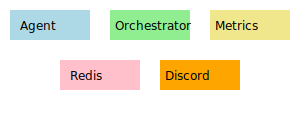

# Architecture Overview

This document outlines Legion's data flow and integration points.

Legion uses a ZeroMQ bus for inter-process messages. Redis stores transient state and queues. The Discord bridge exposes agent events to chat.
