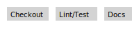

# CI/CD Pipeline

The GitHub Actions workflow installs dependencies, runs lint and tests, and now runs `scripts/docs_build_check.sh`.

`scripts/ci_check.sh` orchestrates lint, tests, and docs build locally.
