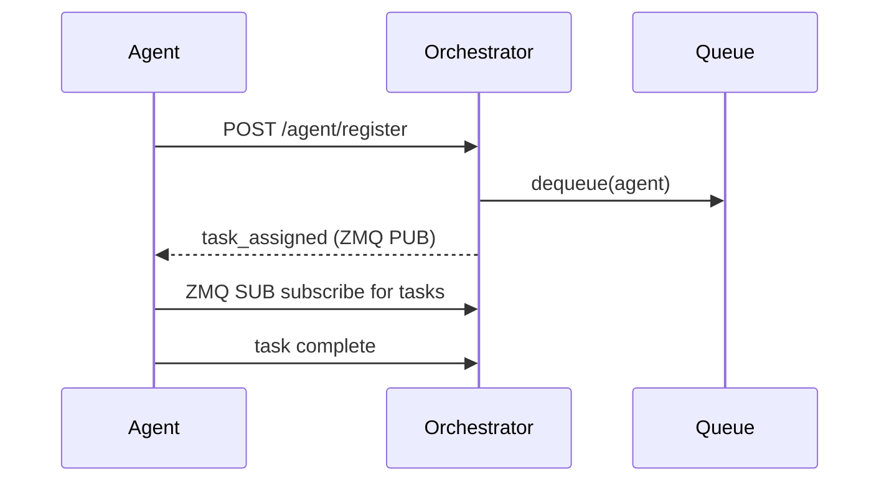

<!-- File: docs/system/queue_protocol.md -->

# Workload Queue Protocol

This document describes how agents interact with the Legion Orchestrator's persistent workload queue.

## Lifecycle



1. **Registration** – Agents send `POST /agent/register` with their `id`, `role`, and `capabilities`. The orchestrator stores metadata and publishes `agent_registered`.
2. **Enqueue** – Tasks are added via internal calls to `WorkloadQueue.enqueue`. Items persist in `memory/state/repo.json`.
3. **Delegation** – When an agent registers or the queue receives a new task, the orchestrator matches by capability and assigns the next task, publishing `task_assigned`.
4. **Completion** – Agents report completion via existing channels (not covered here).

Use `/queue/summary` and `/agent/{id}/tasks` to inspect queue state. The queue
now respects a simple numeric `priority` field where lower values are dequeued
first.

---

## ZMQ Event Example (Legacy/Optional)

This queue publishes agent registration and task assignment events over ZMQ.
Messages are sent on `tcp://127.0.0.1:27070` (see `LEGION_PORT_MAP['zmq_pub']`).

Example payload:

```json
{"event": "task_assigned", "agent_id": "echo", "task_id": "123"}
```

The `event` field may be `agent_registered` or `task_assigned`.
