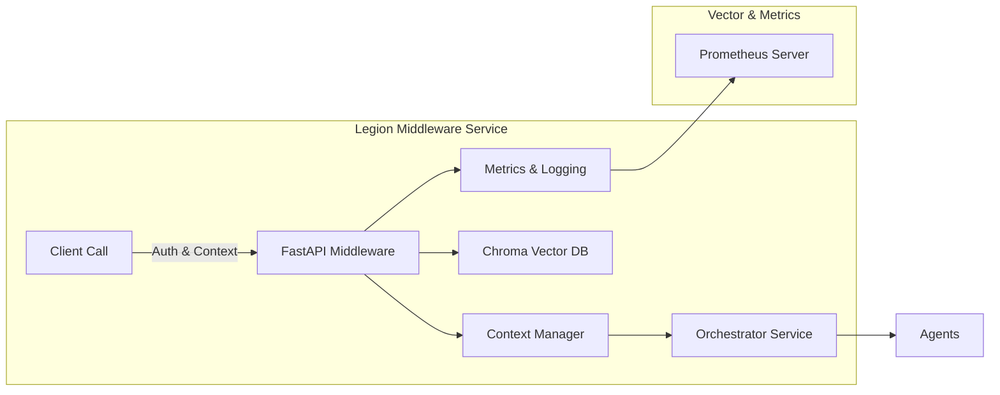

# Legion Middleware & Context Management

## Architecture Diagram


## File-tree Outline
```
middleware/
├── docs/
│   └── architecture.md
├── helm/
│   ├── Chart.yaml
│   └── templates/
│       └── deployment.yaml
├── scripts/
│   └── gen_ports_env.sh
├── src/
│   ├── __init__.py
│   ├── main.py
│   ├── config.py
│   ├── models.py
│   └── middleware/
│       ├── __init__.py
│       ├── context_manager.py
│       └── chroma_client.py
├── tests/
│   ├── test_main.py
│   └── test_chroma_client.py
├── Dockerfile
├── docker-compose.yml
└── requirements.txt
```

## TODO
- Implement authentication dependency and token validation
- Wire up orchestrator client and request/response schemas
- Flesh out context enrichment and logging to central state
- Configure Prometheus exporter and alerts
- Finalize Chroma schema and ensure async batch upsert
- Build Helm `values.yaml` and templates for service, secrets, and config
- Add nightly fine-tuning pipeline scripts

## Open Questions
- Where should the middleware service reside (monorepo under `middleware/` or a separate repo)?
- What authentication mechanism/pattern is standard for agent calls (JWT, API key, OAuth)?
- What network address/credentials will Chroma use in production?
- How many replicas/cluster settings are expected for production?
- Are there specific ADR guidelines or numbering for this middleware (e.g., ADR-001)?
